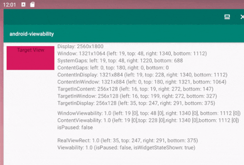

# android-viewability

Viewability calculator and observer for Android with free-form window support.



## Usages

```groovy
repositories {
  maven { url 'https://maven.pkg.github.com/S64/android-viewability' }
}
```

```groovy
implementation 'jp.s64.android.viewability:core:1.0'
implementation 'jp.s64.android.viewability:apparea:1.0'
implementation 'jp.s64.android.viewability:viewarea:1.0'
```
